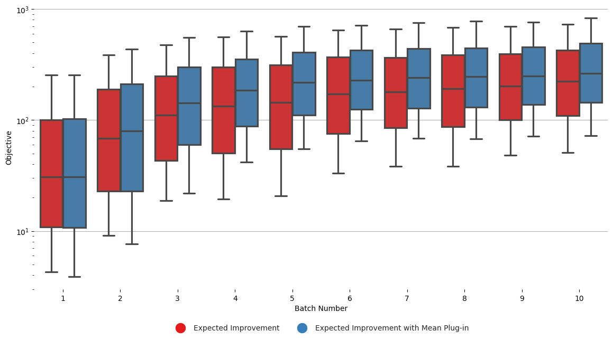
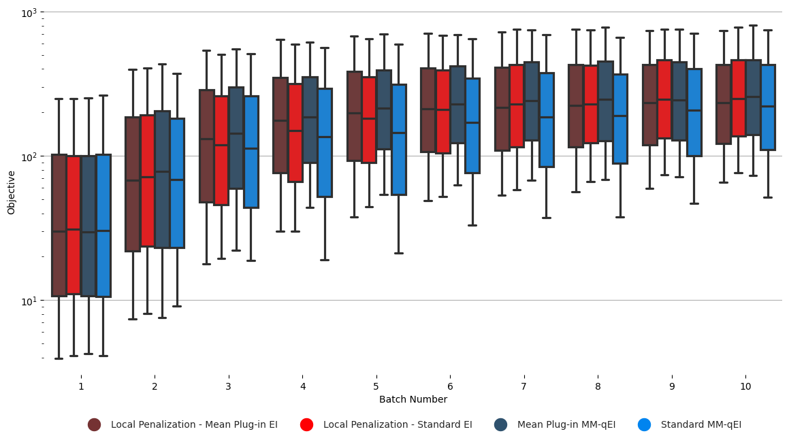
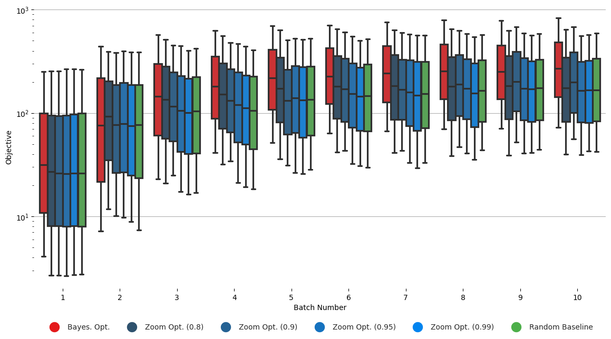

Plotting
========

For just comparing runs where no independently initialised repeats were performed, see the documentation in `scripts/plot_convergence.py`.

.. _comparing_simulator_runs:

Comparing convergence
---------------------

Let's assume that in the config-file, we had the following expansion:

.. code-block:: yaml

    bayesopt:
        acquisition: ["@acquisition", "EXPECTED_IMPROVEMENT", "MEAN_PLUGIN_EXPECTED_IMPROVEMENT"]

In the downloaded data, there will be two expansions in the data and results folders: ``acquisition1`` and ``acquisition2``. 
Let's say that we want to compare the convergence of these two configurations using two different acquisition functions.

The first option, is to visualise the running best objective found of each method. As we have multiple independently-seeded runs for each method, we'll in fact want to visualise the distribution of the running maximum. This can be done with the plotting utilities in ``CellSignalling`` with the following command:

.. code-block:: bash

    python CellSignalling/scripts/plot_convergence_multiple_runs.py --experiment_dirs outputs/Data/acquisition1 outputs/Data/acquisition2 --experiment_labels "Expected Improvement" "Expected Improvement with Mean Plug-in" --output_path figures/comparison.pdf --max_batch_number 10  --init_data_filename init_random_design_data.csv --no_scatter --no_boxplot

To see what the various arguments do, just call ``python CellSignalling/scripts/plot_convergence_multiple_runs.py --help``. 
The default initial filename in the similator loop is ``init_random_design_data``, so there would almost never be a reason to change the ``--init_data_filename`` argument.

Similarly, if you want to plot the distribution of the suggested optimum on the simulator instead, you can run the following command:

.. code-block:: bash

    python CellSignalling/scripts/plot_predicted_optimum_convergence.py --experiment_dirs outputs/Data/acquisition1 outputs/Data/acquisition2 --experiment_labels "Expected Improvement" "Expected Improvement with Mean Plug-in" --output_path Figures/distribution_of_optima_plot.pdf --title "Distribution of optima" --num_simulator_samples_per_optimum 100

This produces the following plot:

Visually grouping different configurations
~~~~~~~~~~~~~~~~~~~~~~~~~~~~~~~~~~~~~~~~~~

Let's say that in the config-file, we expand two different options:

.. code-block:: yaml

    bayesopt:
        acquisition: ["@acquisition", "EXPECTED_IMPROVEMENT", "MEAN_PLUGIN_EXPECTED_IMPROVEMENT"]
        batch_strategy: ["@batch_method", "LocalPenalization", "MomentMatchedEI"]

In the generated data, there will be data and results folders with name: ``acquisition1batch_strategy1``, ``acquisition1batch_strategy2``, etc.

We want to plot these four configurations against one-another, but we would like to visually group the runs with the same ``batch_strategy`` together. 

Both the plotting scripts ``plot_predicted_optimum_convergence.py`` and ``plot_convergence_multiple_runs.py`` support a ``--styled_subset`` that 
allows for grouping different runs together. For the example described above, this can be done like so:

.. code-block:: bash

    python CellSignalling/scripts/plot_predicted_optimum_convergence.py --experiment_dirs Results/acquisition1batch_method1 Results/acquisition2batch_method1 Results/acquisition1batch_method2 Results/acquisition2batch_method2 --experiment_labels "Local Penalization (Mean Plug-in EI)" "Local Penalization - Standard EI" "Mean Plug-in MM-qEI" "Standard MM-qEI" --styled_subset "Local Penalization - Mean Plug-in EI" "Local Penalization - Standard EI" --styled_subset "Mean Plug-in MM-qEI" "Standard MM-qEI" --output_path Results/styled_groups.pdf --num_simulator_samples_per_optimum 100

The resulting plot looks like this:

The crucial part of this command is the ``--styled_subset`` flag. To summarise how it works, imagine you have five ``experiment_labels``: 
"a", "b", "c", "d" and "e". You want to group them visually into groups like so: ``{"a" "b"} {"c"} {"d" "e"}``. I.e. we want "a" and "b" to have the same color, and "d" and "e" to have the same colour. To do so, one would add to the plotting command: ``--styled_subset "a" "b" --styled_subset "c" --styled_subset "d" "e"``.

In the concrete acquisition function example above, we specified four experiment labels with the ``--experiment_labels`` flag, namely:

- "Local Penalization - Mean Plug-in EI"
- "Local Penalization - Standard EI"
- "Mean Plug-in MM-qEI"
- "Standard MM-qEI"

And then we assigned the same colour to the runs with Local Penalization and runs with MM-qEI batch strategies by grouping these labels with the ``--styled_subset`` flag:

- ``--styled_subset "Local Penalization - Mean Plug-in EI" "Local Penalization - Standard EI"``
- ``--styled_subset "Mean Plug-in MM-qEI" "Standard MM-qEI"``

This kind of grouping becomes more useful once we have a lot of runs that fall under the same category. 
This is, for instance, the case when comparing many Zoom Optimization runs with many different hyperparameter settings for the shrinking factor:

