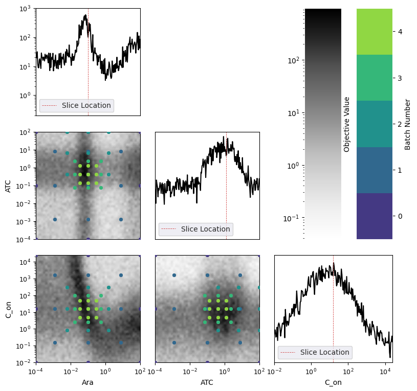

.. _simulators:

Simulators
==========

As explained in :ref:`cell_signalling`, we have biophysical models of cells.
Hence, we might want to see how different optimization strategies work in these simulated settings.

Note that both the simulator and the optimization methods are usually stochastic.
For instance, we might generate an initial batch of points at random, or when optimizing an acquisition function
we might start from different random initializations, and hence output different local optima of the acquisition
function as batch recommendations. 
On the simulator side, there will be some experimental noise on the outputs. 
As such, it's important to run a given optimization algorithm multiple times, starting from different random seeds,
to get a good estimate of its performance.

The scripts in `CellSignalling/scripts` have been written exactly to allow for running these kinds of comparisons on
our in-lab Cell Signalling simulator.

Running a benchmark using the simulator
---------------------------------------

To run the benchmark, one can run the script in ``projects/CellSignalling/cellsig_sim/scripts/run_cell_signalling_loop.py`` from the root
of ABEX. E.g.:

.. code-block:: bash

    python projects/CellSignalling/cellsig_sim/scripts/run_cell_signalling_loop.py --spec_file projects/CellSignalling/Specs/tutorial-wetlab-sim.yml --num_iter 15 --num_runs 100 --strategy Bayesian --enable_multiprocessing --plot_simulated_slices

There are multiple important arguments to this command (you can always get their description by running ``python projects/CellSignalling/cellsig_sim/scripts/run_cell_signalling_loop.py --help``):

- ``--spec_file`` - Path to a yaml spec-file (more on this later)
- ``--num_iter`` - number of optimization iterations for each run. For instance, ``--num_iter 5`` means there will be 5 iterations of the cycle: 1. Suggest an experiment  2. Collect data from the simulator
- ``--num_runs`` - Number of independently seeded optimization runs to perform.
- ``--strategy`` - Can be either ``Bayesian`` or ``Zoom``.
- ``--enable_multiprocessing`` - whether to execute `num_runs` independently seeded runs in parallel.
- ``submit_to_aml`` - whether to submit this experiment to Azure ML to be executed there (more on this :ref:azure_ml . 
- ``--plot_simulated_slices`` - Whether to plot slices through the simulator through the best point found at the end of the run. The plots looks like this:

.. note:

    The ``--strategy`` field ultimately decides which optimization algorithm will be run. 
    Even if in the config, only the options for ``bayesopt`` are specified, but the ``--strategy`` flag is set to ``Zoom``, the optimization algorithm run will still be Zoom. Opt. with default parameters!

.. note:

    The `python` command above will probably run for several hours. For a quicker alternative, reduce `--num_iter`
    and/or `--num_runs`.

Simulator benchmark config
--------------------------

The config for the simulator is similar to the standard config for running ABEX (see :ref:`cell-signalling-configs`)
with the exception of having a few additional fields that configure the simulator (rather than the optimization method):

.. code-block:: yaml

    multimodal: True  # Keep as True, otherwise the simulator is quite boring and all methods converge really quickly
    simulator_noise: 1.0
    num_init_points: 10  # The number of initial points to generate before the optimization routine strats
    init_design_strategy: Random  # How these initial points will be sampled
    incorporate_growth: False  # Keep False; the growth model used is unrealistic
    heteroscedastic_noise: False  # Whether the simulator should generate samples with heteroscedastic noise

Comparing multiple option configurations using config expansion
---------------------------------------------------------------

Multiple configurations can be compared with one call to ``python projects/CellSignalling/cellsig_sim/scripts/run_cell_signalling_loop.py`` by using config expansion (:ref:`expanding_configs`).
For instance, to compare multiple acquisitions:

.. code-block:: bash

    bayesopt:
        acquisition: ["@acquisition", "MEAN_PLUGIN_EXPECTED_IMPROVEMENT", "EXPECTED_IMPROVEMENT"]

Running simulator on Azure ML
-----------------------------

See the section :ref:`azure_ml` to see how to launch simulator runs on Azure ML.