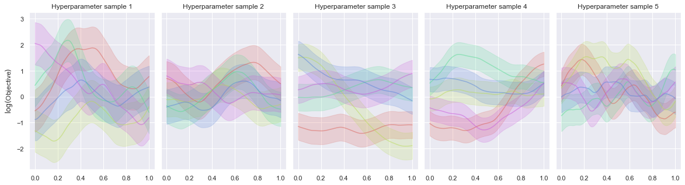

.. _setting-a-prior:

Setting a prior
===============

Setting a reasonable prior is really important:

It's very useful to check that the priors are sensible by visualising samples from the prior Gaussian Process, like in this plot: 

Here is a short code snippet to make similar plots:

.. code-block:: python

    import GPy
    import numpy as np
    import matplotlib.pyplot as plt
    import seaborn as sns
    from pathlib import Path
    from abex.settings import simple_load_config
    sns.set()

    # Path to config
    config = simple_load_config("some_path_to_config_goes_here.yml")

    # Get the priors from config (or specify them yourself)
    lengthscale_prior = config.model.priors["sum.Mat52.lengthscale"].get_prior()
    variance_prior = config.model.priors["sum.Mat52.variance"].get_prior()
    noise_prior = config.model.priors["Gaussian_noise.variance"].get_prior()

    # Plot samples from the priors
    num_subfigures = 5
    num_samples = 5
    fig, axes = plt.subplots(ncols=num_subfigures, figsize=(4*num_subfigures, num_subfigures), sharey=True)
    colors = sns.color_palette("hls", num_subfigures)
    X = np.linspace(0.,1.,500) # 500 points evenly spaced over [0,1]
    X = X[:,None] # reshape X to make it n*D

    plt.subplots_adjust(wspace=0.05)

    for i in range(num_subfigures):
        # Assuming a Matern kernel
        k = GPy.kern.Matern52(input_dim=1, lengthscale=lengthscale_prior.rvs(1), variance=variance_prior.rvs(1))
        noise_std = np.sqrt(noise_prior.rvs(1))

        mu = np.zeros((500)) # vector of the means
        C = k.K(X,X) # covariance matrix
        # Generate 20 sample path with mean mu and covariance C
        Z = np.random.multivariate_normal(mu, C, num_samples)
        for j in range(num_samples):
            axes[i].plot(X[:], Z[j,:], color=colors[j], alpha=0.5)
            axes[i].fill_between(X.ravel(), Z[j, :] - noise_std, Z[j, :] + noise_std, color=colors[j], alpha=0.2)
        axes[i].set_title(f"Hyperparameter sample {i + 1}")
    # Assuming a log-transform
    axes[0].set_ylabel("$\log($Objective$)$")

    plt.savefig("example_gp_prior_samples_plot.pdf", bbox_inches="tight")
